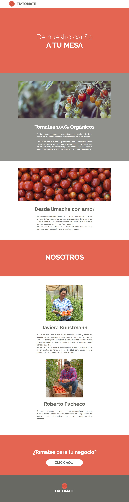

# Tia_tomates
> Creando HTML de proyecto usando BEM

## Instrucciones.

La empresa productora de tomates orgánicos llamada Tía Tomate pide a nuestro equipo crear una
nueva versión de su página acerca de.
En ella desean mostrar a sus clientes una pequeña reseña sobre su historia, la procedencia de sus
productos y mostrar la calidad de personas que trabajan cosechando estas verduras.
Teniendo en cuenta lo anterior, el diseñador UX/UI, luego de hacer una investigación acuciosa sobre
el cliente de Tía Tomate, nos hace entrega de un mockup con la respuesta visual del sitio que pidió
doña Javiera.
Los entregables se encuentran en el archivo Apoyo Desafío - Tía Tomate
Por último deben hacer entrega de un archivo comprimido con todos los archivos necesarios para
comenzar a maquetar la página.

## Requisitos

- Crear estructura base del proyecto (0.05 puntos)
- Crear directorios necesarios para el proyecto
- Crear documento HTML
- Crear directorios para imágenes, Sass y CSS
- Crear archivo CSS a compilar
- Agregar imágenes del proyecto
- Crear estructura de proyecto para Sass usando el patrón 7-1 (0.20 puntos)
- Crear directorios del patrón 7-1
- En el caso de no usar un directorio mantener vacío
- Separar lógica visual del proyecto usando parciales, directivas @import y manifiesto (0.20
puntos)
- Crear archivos parciales necesarios para el proyecto
- Crear manifiesto del proyecto Sass
- Agregar parciales en manifiesto usando la directiva @import
HINT: Los @imports deberán seguir un orden mencionado en https://sass-guidel
in.es/#architecture
- Construir estructura HTML utilizando etiquetas semánticas (0.15 puntos)
- Utilizar a lo menos 3 etiquetas semánticas como header , section , footer , nav o
article
- Crear clases semánticas utilizando nomenclatura de metodología BEM
- Agregar una clase bloque a contacto, al título una clase de elemento y al botón una clase
modificadora siguiendo la normas espificadas en la nomenclatura BEM
- Es importante como buena práctica escribir en inglés las clases
- Utilizar variables de Sass para reutilizar código CSS/SCSS (0.10 puntos)
- Agregar variables de colores, fuentes, tamaño y grosor de fuentes siguiendo la guía de
estilos
- Utilizar a lo menos 5 variables en el proyecto
- Crear estilos base del proyecto (0.10 puntos)
- Agregar estilos reset al proyecto
- Agregar estilos base para tipografías del proyecto
- Identificar elementos que constituyen la página del proyecto web (0.10 puntos)
- Definir los estilos a en la página
- Crear parciales para la página
- Identificar colores de fondo usados en representación visual
- Agregar colores de fondo a elementos del layout como header , secciones y footer
- Definir reglas a CSS/SCSS a utilizar en la página
- Crear estilos para componentes del proyecto web (0.10 puntos)
- Identificar componentes a dar estilos
- Crear parciales para componentes
- Denifir reglas CSS/SCSS a utilizar componentes
